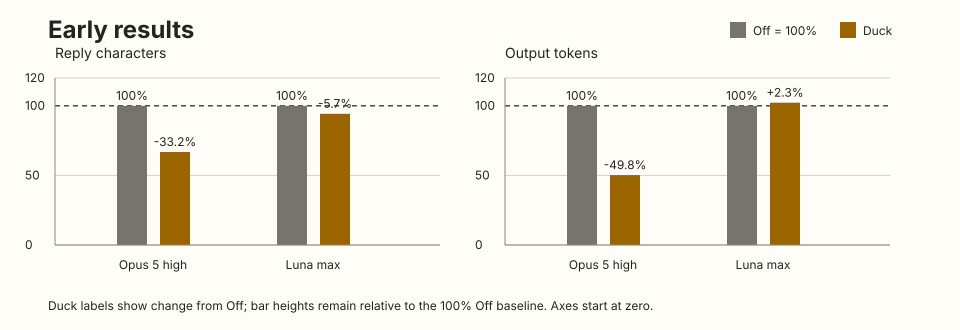

<p align="center"></p>

# i-am-the-duck

橡皮鴨除錯法，反過來用。你是那隻鴨子。

**[English](../README.md)**

## 這是什麼

橡皮鴨除錯法是個老招：把你的程式一行一行講給桌上的橡皮鴨聽，講到一半，bug 自己就找到了。鴨子什麼都沒做，有用的是「非得用白話講出來」這件事。

這個外掛把它反過來。做事的是 coding agent，鴨子是你。它會把重要的工作講到你不用看程式碼、不用看工具輸出也能跟上：現在在做什麼、為什麼、做完怎樣，以及現有證據支持到哪裡。未測或推測的部分，只有在會影響你能依賴什麼時才說。

一開始是惡搞，留下來是因為把改動用白話講出來，有時會暴露出理由根本沒交代。

## 初步結果

**Opus 5（high）的回覆字元平均少 33%，輸出 token 平均少 50%。**



Duck 幫助你理解 agent 的行為與判斷依據，減少重複說明與閱讀負擔。這些是初步評測觀察，後續會補上更多任務與模型的評測。[數據與 Astra 盲讀結果](../evals/results/README.md)。

## 會差在哪

沒裝的時候，長對話會慢慢長出自己的速記：

> Phase C 完成，全綠，fix 已合進 pipeline。

裝了之後：

> 服務重啟後會恢復逾時檢查，不會漏掉已經超時的工作。`npm test`：24 過 0 敗。Codex 那邊沒跑，這台沒裝。

三個習慣：

- **動手前**，每段有明確目的的工作，先說要做什麼、為什麼。讀檔、搜尋、跑測試不用先講。
- **做完後**，說發生了什麼，以及值得交代的證據或差異。未測或推測的部分，只有在會影響你能依賴什麼或下一步時才說；不用為了湊完整而多跑檢查。
- **用詞**直接描述具體動作或結果。程式碼、規格、計畫、票單或前面對話裡的名稱，不會自動變成解釋。要讓人定位或分辨時才用原名，接著說它做什麼；其他情況直接換成具體動作或結果。對話壓縮後沿用已建立的脈絡，不重講標籤。

做決定時，講每個選項在這個決定裡的取捨；需要時說證據是測過的，還是預期。交給別的 agent 的工作，回來時摘要結果，附上有沒有核過和重要限制。

它不管你批准什麼、任務做到哪、什麼有風險、程式對不對。它只管讓 agent 把話講清楚。

## 安裝

Claude Code：

```
/plugin marketplace add davidleitw/i-am-the-duck
/plugin install i-am-the-duck@i-am-the-duck
```

Codex：

```
codex plugin marketplace add davidleitw/i-am-the-duck
codex plugin add i-am-the-duck@i-am-the-duck
```

需要 PATH 上有 `node` 18 以上。開一個新 session：每次 session 開頭和對話被壓縮之後，會有一個小程式自動跑一次，把完整規則放進給 agent 的指示裡，agent 不用再搜尋或重讀。Codex 要先打 `/hooks`，看過這個 hook 並按信任，沒按之前 Codex 會跳過它。

agent 又開始講速記的時候，在 Claude Code 打 `/i-am-the-duck:duck`，在 Codex 打 `$i-am-the-duck:duck`。

其他 host，以及每個 host 的更新和移除指令：**[INSTALL.md](../INSTALL.md)**（英文）。

| Host | 會不會替你載入規則 | 我們測過沒 |
|---|---|---|
| Claude Code | 會，每次 session 開頭 | 測過 |
| Codex | 會，信任 hook 之後 | 測過 |
| Gemini CLI | 會，透過 `GEMINI.md` | 沒有 |
| Qwen Code | 不保證，自己叫 `duck` 才穩 | 沒有 |
| Kimi Code CLI | 不保證，自己叫 `duck` 才穩 | 沒有 |
| Cursor、Zed、Copilot、Amp 等 | 不會，自己叫 `duck` | 沒有 |

「測過」是指在作者的機器上開真的 session、規則在第一句回覆前載入了。對話壓縮之後會不會重載，兩個 host 都還沒在真的 session 裡測過，只測過 hook 收到那個輸入時的回應。

## 調整

直接在對話裡講：短一點、細一點、一步一步、只講最後結果。agent 會照做到這段對話結束，不會存到任何地方。

## 移除

在 Claude Code 打 `/i-am-the-duck:unduck`，在 Codex 打 `$i-am-the-duck:unduck`。它會告訴你要移除什麼，等你說好，再移除外掛。也可以自己來：

```
claude plugin uninstall i-am-the-duck@i-am-the-duck   # 裝在 project 或 local 的話加 --scope
codex plugin remove i-am-the-duck@i-am-the-duck
```

自己手動移除的話，你當初加的 marketplace 還會留著；打 `/i-am-the-duck:unduck` 的話它會問你要不要一起移除。手動的指令是 `claude plugin marketplace remove i-am-the-duck`，Codex 是 `codex plugin marketplace remove i-am-the-duck`。

## 裡面有什麼

| 路徑 | 是什麼 |
|---|---|
| `skills/duck/SKILL.md` | 規則本體。agent 讀的就是這個。 |
| `skills/unduck/` | 移除用的 skill。 |
| `hooks/` | session 開頭跑的 hook：session 開頭和壓縮後都把完整規則放進指示裡。 |
| `.claude-plugin/`、`.codex-plugin/`、`.agents/` | Claude Code 和 Codex 找外掛用的設定檔。 |
| `gemini-extension.json`、`GEMINI.md`、`qwen-extension.json`、`kimi.plugin.json` | 其他 host 的同類設定檔。`GEMINI.md` 是匯入規則，不是複製一份。 |
| `INSTALL.md` | 安裝、更新、移除，一個 host 一段。 |

## 怎麼來的

agent 的長對話會長出一套私人語言。測試明明有一個失敗，它說「全綠」；「Phase C」來自一份使用者沒打開過的計畫。使用者保有決定權，卻拿不到做決定需要的資訊。

## 授權

MIT

維護者可使用獨立的[評測流程](../evals/README.md)；它不會由正式 skill 或 hook 載入。
