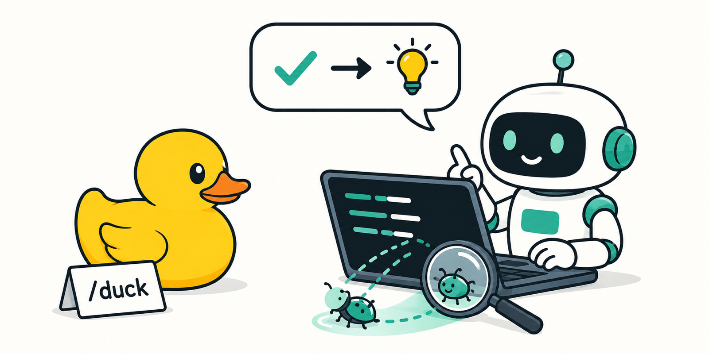

<p align="center"></p>

# i-am-the-duck

橡皮鴨除錯法，反過來用。你是那隻鴨子。

## 這是什麼

橡皮鴨除錯法是個老招：把你的程式一行一行講給桌上的橡皮鴨聽，講到一半，bug 自己就找到了。鴨子什麼都沒做，有用的是「非得用白話講出來」這件事。

這個外掛把它反過來。做事的是 coding agent，鴨子是你。它得把每個改動講到你不用看程式碼、不用看工具輸出也能跟上：要改什麼、為什麼改、改完怎樣、根據是什麼、還有什麼沒確認。

一開始是惡搞，留下來是因為一個非得用白話解釋改動的 agent，也會在改動說不出理由的時候自己發現。

## 會差在哪

沒裝的時候，長對話會慢慢長出自己的速記：

> Phase C 完成，全綠，fix 已合進 pipeline。

裝了之後：

> 把逾時判斷從 hook 移到 daemon，這樣重啟後不會漏掉。`npm test`：24 過 0 敗。Codex 那邊沒跑，這台沒裝。

三個習慣：

- **動手前**，每一段有明確目的的工作，先一兩句：要改什麼、為什麼。讀檔、搜尋、跑測試不用先講。
- **做完後**，講產出什麼、根據是什麼、還有什麼沒確認。每個數字都附上跑出它的指令。沒跑就不能說「過了」。
- **用詞**用你和 repo 已經在用的。一次性的步驟不取名。會反覆出現的才取名，而且第一次出現就用一句話解釋。你沒讀過的計畫、票單裡的標籤，也要解釋。

請你做決定時，每個選項附上證據。交給別的 agent 的工作，回來時是摘要，並說有沒有核過。

它不管你批准什麼、任務做到哪、什麼有風險、程式對不對。它只管讓 agent 把話講清楚。

## 安裝

Claude Code：

```
/plugin marketplace add davidleitw/i-am-the-duck
/plugin install i-am-the-duck@i-am-the-duck
```

Codex：

```
codex plugin marketplace add davidleitw/i-am-the-duck
codex plugin add i-am-the-duck@i-am-the-duck
```

需要 PATH 上有 `node`。開一個新 session：每次 session 開頭和對話被壓縮之後，會有一個小程式自動跑一次，叫 agent 去載入規則，你不用打任何東西。Codex 要先打 `/hooks`，看過這個 hook 並按信任，沒按之前 Codex 會跳過它。

agent 又開始講速記的時候，在 Claude Code 打 `/i-am-the-duck:duck`，在 Codex 打 `$i-am-the-duck:duck`。

## 調整

直接在對話裡講：短一點、細一點、一步一步、只講最後結果。agent 會照做到這段對話結束，不會存到任何地方。

## 移除

在 Claude Code 打 `/i-am-the-duck:unduck`，在 Codex 打 `$i-am-the-duck:unduck`。它會列出要刪的東西，等你說好，先清掉舊版手動安裝的殘留，再移除外掛。也可以自己來：

```
claude plugin uninstall i-am-the-duck@i-am-the-duck   # 裝在 project 或 local 的話加 --scope
codex plugin remove i-am-the-duck@i-am-the-duck
```

## 裡面有什麼

| 路徑 | 是什麼 |
|---|---|
| `skills/duck/SKILL.md` | 規則本體。agent 讀的就是這個。 |
| `skills/unduck/` | 移除用的 skill 和它叫的腳本。 |
| `hooks/` | session 開頭跑的 hook：一句叫 agent 載入規則，壓縮後叫它重載。 |
| `.claude-plugin/`、`.codex-plugin/`、`.agents/` | 兩台主機找外掛用的設定檔。 |

## 怎麼來的

agent 的長對話會長出一套私人語言。測試明明有一個失敗，它說「全綠」；「Phase C」來自一份使用者沒打開過的計畫。使用者保有決定權，卻拿不到做決定需要的資訊。

## 授權

MIT
